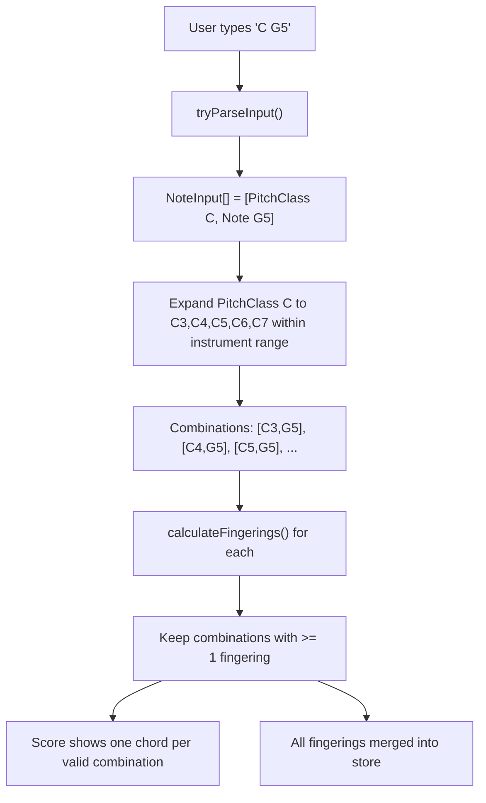

# Octave-Flexible Note Input

## Current Behavior

Notes must include an octave digit (e.g., `C4`, `G#5`). The parser in `tryParse()` ([fingerings.ts](packages/string-fingerings/fingerings.ts) line 35) rejects input without a trailing digit. One chord is shown in the score, and one set of fingerings is calculated.

## Design

Introduce a `PitchClass` type (note name + alteration, no octave) alongside the existing `Note` type. A union type `NoteInput = Note | PitchClass` flows from input to the view. When the view encounters `PitchClass` entries, it expands them into all octaves within the instrument's playable range, computes fingerings for each resulting `Note[]` combination, and passes all valid combinations to the score display.



## Changes by File

### 1. `packages/string-fingerings/types.ts` -- new types

Add:

```typescript
export interface PitchClass {
  name: "A" | "B" | "C" | "D" | "E" | "F" | "G";
  alteration: "#" | "b" | "x" | "bb" | "";
  text: () => string;
}

export type NoteInput = Note | PitchClass;
```

### 2. `packages/string-fingerings/fingerings.ts` -- parsing and expansion

- Add `PitchClassImpl` class implementing `PitchClass`, with `text()` returning e.g. `"C#"`.
- Add `tryParseInput(noteText: string): NoteInput | string`:
  - If last char is a digit, delegate to existing `tryParse()`.
  - Otherwise, parse letter + optional alteration only. Valid inputs: `C`, `C#`, `Db`, `Ebb`, `Fx`.
- Add `isNote(input: NoteInput): input is Note` type guard.
- Add `expandPitchClass(pc: PitchClass, minMidi: number, maxMidi: number): Note[]` -- generates a `Note` for every octave (0-9) whose MIDI number falls within `[minMidi, maxMidi]`.
- Add `generateNoteCombinations(inputs: NoteInput[], minMidi: number, maxMidi: number): Note[][]` -- cartesian product of expanded inputs.
- Export all new functions and types from [index.ts](packages/string-fingerings/index.ts).

### 3. `website/src/components/NotesInput.vue` -- flexible parsing

- Import `tryParseInput` and `NoteInput` instead of `tryParse` and `Note`.
- Change `defineModel` type from `Note[]` to `NoteInput[]`.
- Update `reprToNotes` computed to use `tryParseInput`.
- Update `notesToRepr` to call `.text()` on each element (works for both `Note` and `PitchClass`).
- MIDI input path is unchanged (MIDI always produces notes with octaves).

### 4. `website/src/StringStopsView.vue` -- combination logic

- Change `parsedNotes` ref type to `NoteInput[]`.
- In the watcher, compute the instrument's playable MIDI range from `instrument.strings` (lowest open string minus extensions to highest open string + stops).
- Call `generateNoteCombinations(parsedNotes, minMidi, maxMidi)` to get all `Note[][]` combinations.
- For each combination, call `calculateFingerings()`. Collect:
  - `validCombinations: Note[][]` -- combinations with at least one fingering.
  - `allFingerings: Stop[][]` -- merged fingerings from all valid combinations.
- Call `fingeringsStore.loadFingerings(allFingerings)`.
- Pass `validCombinations` to `ScoreDisplay` (new prop).
- If all notes already have octaves, there's only one combination, so behavior is unchanged.

### 5. `website/src/components/ScoreDisplay.vue` -- multiple chords

- Change the `notes` prop to accept `{note: Note, harmonic: boolean}[][]` (array of chord groups) in addition to the current format.
- In `showScore()`, build ABC notation with one chord per group: `[CEG]2 [C'E'G]2 ...`
- Each chord represents one valid octave combination.
- When only one group is provided, rendering is identical to current behavior.

### 6. Documentation updates

**[README.md](README.md)** -- Add a bullet to the features list (line 12 area):

- `Note input supports omitting the octave (e.g. "C" or "C#"); all valid octave combinations within the instrument's range are shown.`

**[CHANGELOG.md](CHANGELOG.md)** -- Add a new date entry at the top (below the header), following the existing Keep a Changelog format:

```markdown
## [2026-03-03]

### Added

- Notes can be input without an octave. All valid octave combinations are tried and displayed in the score.
```

**[packages/string-fingerings/CHANGELOG.md](packages/string-fingerings/CHANGELOG.md)** -- Add a new version entry at the top (version TBD at publish time):

```markdown
## [Unreleased]

### Added

- `PitchClass` type and `NoteInput` union type.
- `tryParseInput()` for parsing notes with optional octave.
- `isNote()` type guard.
- `expandPitchClass()` and `generateNoteCombinations()` helpers.
```

### Backward Compatibility

- Scordatura and highest-stops inputs in StringStopsView pass `Note[]` to NotesInput. Since `Note` structurally satisfies `NoteInput` (it has `name`, `alteration`, and `text()`), these continue working without changes.
- When all input notes have octaves, the expansion produces exactly one combination, preserving current behavior.
