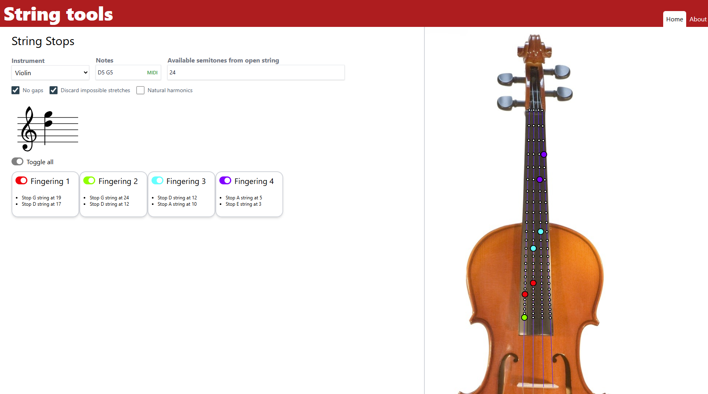

# 🎻 String Tools

This is the repository of [String Tools](https://stringinstrumenttools.netlify.app) site. It is built with Vue 3.

## String Stops

This tool calculates multiple-stop fingerings for the provided notes.


Features:
- Four instruments: violin, viola, cello and double 5-string double bass.
- Note input by text (e.g. `D5 G5`) or MIDI input.
- Can select how far down the fingerboard can the player reach.
- Optionally, calculates fingerings with gaps (skipped strings in the middle) which are useful for pizzicato.
- Optionally, can include fingerings with finger stretches that are too wide.
- Optionally, it includes fingerings with natural harmonics.
- The instrument is shown with a superimposed diagram with the selected fingerings.
- Can select/deselect fingerings for display in the diagram.
- Each found fingering is displayed in a card with a detailed description.
- The notes are displayed in score view.

# Contributors

## Recommended IDE Setup

[VSCode](https://code.visualstudio.com/) + [Volar](https://marketplace.visualstudio.com/items?itemName=Vue.volar) (and disable Vetur).

## Type Support for `.vue` Imports in TS

TypeScript cannot handle type information for `.vue` imports by default, so we replace the `tsc` CLI with `vue-tsc` for type checking. In editors, we need [Volar](https://marketplace.visualstudio.com/items?itemName=Vue.volar) to make the TypeScript language service aware of `.vue` types.

## Project Setup

```sh
npm install
```

### Compile and Hot-Reload for Development

```sh
npm run dev
```

### Type-Check, Compile and Minify for Production

```sh
npm run build
```

### Run Unit Tests with [Vitest](https://vitest.dev/)

```sh
npm run test:unit
```

### Run End-to-End Tests with [Playwright](https://playwright.dev)

```sh
# Install browsers for the first run
npx playwright install

# When testing on CI, must build the project first
npm run build

# Runs the end-to-end tests
npm run test:e2e
# Runs the tests only on Chromium
npm run test:e2e -- --project=chromium
# Runs the tests of a specific file
npm run test:e2e -- tests/example.spec.ts
# Runs the tests in debug mode
npm run test:e2e -- --debug
```

### Lint with [ESLint](https://eslint.org/)

```sh
npm run lint
```
